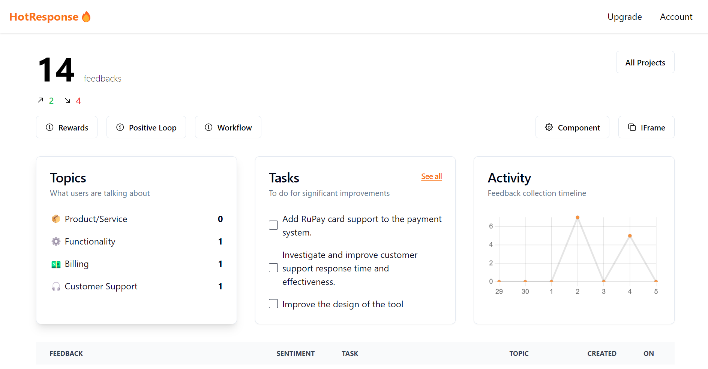

# HotResponse🔥

A SaaS platform that enables serial entrepreneurs and indie hackers to collect and analyze valuable feedback from their users in-app, to validate or improve their MVP.

1. Customize and copy the IFrame code from HotResponse and paste it into your project.
2. The feedback received is analyzed by AI
3. AI generates relevant actionable tasks that lead to significant improvements.

## Coming soon

### Feedback Actions

If the feedback received is positive, upselling and cross-selling can be promoted to that customer.

### CRM

User tracking, solving their individual problems, reaching out to them and eventually turning them into paying customers.
